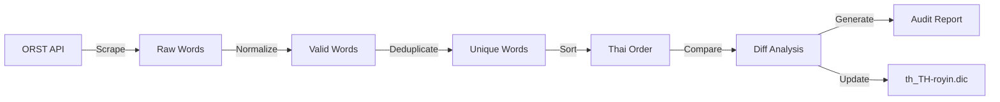

# ORST Dictionary Scraper

[](https://www.gnu.org/licenses/gpl-3.0)

[](https://github.com/SyafiqHadzir/orst-scrapper/actions/workflows/ci.yml)
[](https://github.com/SyafiqHadzir/orst-scrapper/actions/workflows/codeql.yml)
[](https://github.com/astral-sh/ruff)
[](http://mypy-lang.org/)

> Production-grade Python tool to synchronize `th_TH-royin.dic` with the official [Thai Royal Institute Dictionary (ORST)](https://dictionary.orst.go.th/).

## ✨ Features

- 🔄 **Automated Scraping**: Extracts all headwords from ORST dictionary (ก to ฮ)
- 🛡️ **Polite Crawler**: Respects server resources with configurable rate limiting
- 💾 **Resumable**: Automatically saves progress and resumes on interruption
- 🔍 **Smart Validation**: Unicode normalization, Thai character validation, duplicate detection
- 📊 **Audit Reports**: Comprehensive diff analysis with added/removed word tracking
- ✅ **Royal Institute Sorting**: Proper Thai alphabetical ordering (not UTF-8 binary)
- 🧪 **Fully Tested**: Comprehensive unit test coverage with type safety

## 🚀 Quick Start

### Installation

```bash
# Clone the repository
git clone https://github.com/SyafiqHadzir/orst-scrapper.git
cd orst-scrapper

# Install dependencies
pip install -r requirements.txt
```

### Usage

**Dry run** (recommended first time):
```bash
python update_royin_dictionary.py --dry-run
```

**Full update**:
```bash
python update_royin_dictionary.py
```

**Review the audit report**:
```bash
cat reports/audit_report.md
```

## 📖 Documentation

- **[Usage Guide](docs/USAGE.md)**: Comprehensive usage instructions, CLI options, and troubleshooting
- **[Architecture](docs/ARCHITECTURE.md)**: System design, component breakdown, and technical details
- **[Development](docs/DEVELOPMENT.md)**: Developer setup, testing, and contribution guidelines
- **[Contributing](CONTRIBUTING.md)**: How to contribute to this project

## 💡 How It Works



### Architecture Overview

The scraper is built with production-grade practices:

- **API Client** ([api_client.py](scripts/api_client.py)): HTTP client with retry logic, caching, and rate limiting
- **Thai Utilities** ([thai_utils.py](scripts/thai_utils.py)): Unicode normalization, validation, and Royal Institute sorting
- **Progress Tracker** ([progress_tracker.py](scripts/progress_tracker.py)): Resumable operations with JSON persistence
- **Scraper Engine** ([orst_scraper.py](scripts/orst_scraper.py)): Main orchestrator for the scraping workflow
- **Hunspell Writer** ([hunspell_writer.py](scripts/hunspell_writer.py)): Generates properly formatted .dic files
- **Diff Analyzer** ([dictionary_diff.py](scripts/dictionary_diff.py)): Compares dictionaries and generates audit reports

For detailed technical information, see [Architecture Documentation](docs/ARCHITECTURE.md).

## 🛠️ Advanced Usage

### Command-Line Options

```bash
# Increase delay for slower, more polite crawling
python update_royin_dictionary.py --delay 500

# Verbose logging
python update_royin_dictionary.py --verbose

# Skip backup creation
python update_royin_dictionary.py --no-backup
```

### Resume Interrupted Scraping

The scraper automatically saves progress. If interrupted, simply run again:

```bash
python update_royin_dictionary.py
```

To start fresh:
```bash
rm data/scraper_progress.json
python update_royin_dictionary.py
```

For complete usage instructions, see [Usage Guide](docs/USAGE.md).

## 🧪 Testing

```bash
# Run all tests
pytest tests/ -v

# With coverage
pytest tests/ --cov=scripts --cov-report=html

# Type checking
mypy scripts/

# Linting
ruff check scripts/
```

For development setup, see [Development Guide](docs/DEVELOPMENT.md).

## 📁 Project Structure

```
orst-scrapper/
├── docs/                      # Documentation
│   ├── ARCHITECTURE.md        # System design
│   ├── USAGE.md              # User guide
│   └── DEVELOPMENT.md        # Developer guide
├── scripts/                   # Core scraper modules
│   ├── api_client.py         # ORST API client
│   ├── thai_utils.py         # Thai language utilities
│   ├── orst_scraper.py       # Main scraper engine
│   └── ...                   # Other modules
├── tests/                     # Unit tests
├── data/                      # Runtime data (gitignored)
├── reports/                   # Generated reports (gitignored)
├── update_royin_dictionary.py # Main entry point
└── requirements.txt          # Python dependencies
```

## 🤝 Contributing

Contributions are welcome! Please see [CONTRIBUTING.md](CONTRIBUTING.md) for guidelines.

This project follows best practices:

- ✅ Type hints throughout
- ✅ Comprehensive error handling
- ✅ Structured logging
- ✅ Progress tracking and resumability
- ✅ API response caching
- ✅ Rate limiting (polite crawler)
- ✅ Unit test coverage
- ✅ Proper Unicode handling
- ✅ Royal Institute Thai sorting

## 📝 License

This project is licensed under the GPL-3.0 License - see the [LICENSE](LICENSE) file for details.

## 🙏 Credits

- **Scraper System**: Built by [Syafiq Hadzir](https://github.com/SyafiqHadzir)
- **ORST Dictionary**: [The Royal Institute of Thailand](https://dictionary.orst.go.th/)
- **Original hunspell-TH**: Sila Chunwijitra, Nisakorn Valyasevi, Pakkapon Phongthawee

## 📧 Contact

Syafiq Hadzir - [@syafiqhadzir_](https://twitter.com/syafiqhadzir_) - inquiry@syafiqhadzir.dev

Project Link: [https://github.com/SyafiqHadzir/orst-scrapper](https://github.com/SyafiqHadzir/orst-scrapper)

---

<p align="center">Made with ❤️ for the Thai language community</p>
