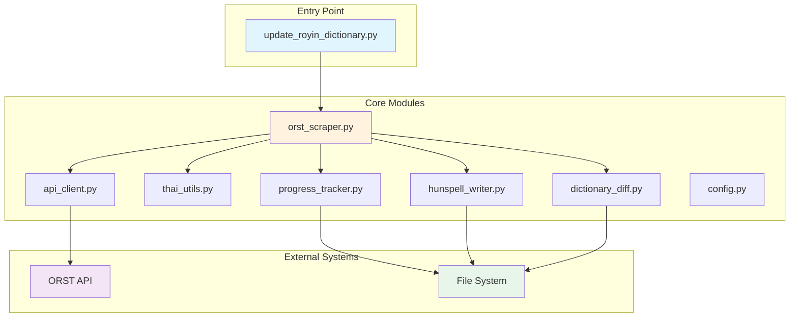
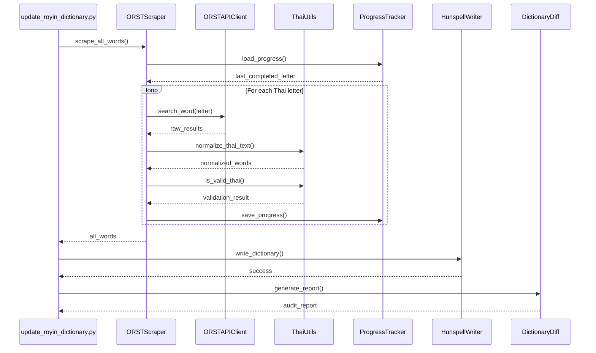

# Architecture Documentation

## Overview

The ORST Dictionary Scraper is built with a modular, production-grade architecture designed for reliability, maintainability, and extensibility. The system follows clean architecture principles with clear separation of concerns.

## System Architecture



## Component Breakdown

### 1. Configuration Management (`scripts/config.py`)

**Purpose**: Centralized configuration and constants management

**Key Responsibilities**:
- Define API endpoints and request parameters
- Set crawler behavior (rate limiting, retries, timeouts)
- Configure processing options (Unicode normalization, validation rules)
- Manage file paths and directory structure

**Design Decisions**:
- Uses Python dataclasses for type-safe configuration
- Environment variable support for sensitive data
- Immutable configuration to prevent runtime modification
- Clear separation between development and production settings

**Configuration Categories**:
```python
# API Configuration
ORST_API_BASE_URL = "https://dictionary.orst.go.th/api"
SEARCH_ENDPOINT = "/search"
TIMEOUT_SECONDS = 30

# Crawler Settings
DEFAULT_DELAY_MS = 200      # Polite crawling delay
MAX_RETRIES = 3             # Retry failed requests
BACKOFF_FACTOR = 2          # Exponential backoff multiplier

# Processing Settings
INCLUDE_COMPOUND_WORDS = True
NORMALIZE_UNICODE = True
VALIDATE_THAI_ONLY = True
```

---

### 2. API Client (`scripts/api_client.py`)

**Purpose**: HTTP client for interacting with the ORST Dictionary API

**Key Features**:
- **Automatic Retry Logic**: Exponential backoff for failed requests
- **Response Caching**: Disk-based cache to minimize server load
- **Rate Limiting**: Configurable delay between requests
- **Error Handling**: Comprehensive exception handling with logging

**Architecture Pattern**: Adapter Pattern

The API client acts as an adapter between the ORST API and our application, abstracting away HTTP complexities and providing a clean interface.

**Class Structure**:
```python
class ORSTAPIClient:
    def __init__(self, cache_dir: Path, delay_ms: int)
    def search_word(self, query: str) -> List[Dict]
    def _make_request(self, params: Dict) -> Response
    def _get_cached_response(self, cache_key: str) -> Optional[Dict]
    def _cache_response(self, cache_key: str, data: Dict)
```

**Request Flow**:
1. Check cache for existing response
2. If cache miss, make HTTP request with retry logic
3. Validate response structure and status code
4. Cache successful responses
5. Apply rate limiting delay before returning

**Caching Strategy**:
- Cache key: MD5 hash of request parameters
- Cache format: JSON files in `data/cache/`
- Cache invalidation: Manual or by time-based cleanup
- Benefits: Faster development iteration, reduced server load

---

### 3. Thai Language Utilities (`scripts/thai_utils.py`)

**Purpose**: Thai language processing and validation utilities

**Core Functionality**:

#### Unicode Normalization
Converts Thai text to NFC (Normalization Form Canonical Composition) to ensure consistent representation:
- Combines base characters with combining marks
- Handles Thai vowels and tone marks correctly
- Prevents duplicate entries due to Unicode variants

```python
def normalize_thai_text(text: str) -> str:
    """Normalize Thai text using Unicode NFC normalization."""
    return unicodedata2.normalize('NFC', text)
```

#### Thai Character Validation
Validates that text contains only valid Thai characters:
- Thai consonants (ก-ฮ)
- Thai vowels and tone marks
- Thai numerals (๐-๙)
- Essential punctuation

```python
def is_valid_thai(text: str) -> bool:
    """Check if text contains only valid Thai characters."""
    THAI_RANGES = [
        (0x0E01, 0x0E3A),  # Thai consonants and vowels
        (0x0E40, 0x0E5B),  # Thai vowels and marks
    ]
    # Validation logic...
```

#### Royal Institute Sorting

**Challenge**: Thai alphabetical order differs from UTF-8 binary sorting.

**Solution**: Custom collation key generator that implements Royal Institute of Thailand sorting rules.

**Implementation Details**:
```python
THAI_SORT_ORDER = "กขฃคฅฆงจฉชซฌญฎฏฐฑฒณดตถทธนบปผฝพฟภมยรลวศษสหฬอฮ"

def thai_sort_key(word: str) -> tuple:
    """Generate sort key for Thai Royal Institute ordering."""
    key = []
    for char in word:
        if char in THAI_SORT_ORDER:
            key.append(THAI_SORT_ORDER.index(char))
        else:
            key.append(ord(char))  # Fallback to Unicode
    return tuple(key)
```

**Sorting Process**:
1. Extract base consonant from each word
2. Look up consonant position in Royal Institute order
3. Generate tuple of indices for multi-character sorting
4. Use Python's `sorted()` with custom key function

---

### 4. Progress Tracker (`scripts/progress_tracker.py`)

**Purpose**: Resumable operation tracking with persistent state

**Design Pattern**: Memento Pattern

Captures and externalizes scraper state so operations can be resumed after interruption.

**State Management**:
```python
class ProgressTracker:
    def __init__(self, progress_file: Path)
    def save_progress(self, current_letter: str, words_collected: int)
    def load_progress(self) -> Optional[Dict]
    def clear_progress(self)
    def get_last_completed_letter(self) -> Optional[str]
```

**Persistence Format** (JSON):
```json
{
    "current_letter": "ฐ",
    "completed_letters": ["ก", "ข", "ค"],
    "words_collected": 15423,
    "last_updated": "2025-12-23T12:00:00Z",
    "version": "1.0"
}
```

**Benefits**:
- **Fault Tolerance**: Recover from crashes, network failures, or interruptions
- **Transparency**: Users can inspect progress state manually
- **Efficiency**: Avoid re-scraping already processed data
- **Development**: Test individual letter ranges without full scraping

---

### 5. Scraper Engine (`scripts/orst_scraper.py`)

**Purpose**: Main orchestrator for the scraping workflow

**Architecture Pattern**: Façade Pattern + Template Method

Provides a simplified interface to the complex subsystems and defines the skeleton of the scraping algorithm.

**Main Workflow**:
```python
class ORSTScraper:
    def scrape_all_words(self) -> Set[str]:
        # 1. Initialize progress tracker
        # 2. For each Thai letter (ก to ฮ):
        #    a. Check if already processed
        #    b. Query API for words starting with letter
        #    c. Extract and validate headwords
        #    d. Apply Unicode normalization
        #    e. Save progress
        # 3. Deduplicate words
        # 4. Return final word list
```

**Data Flow**:


**Error Handling Strategy**:
- Letter-level retry: If scraping fails for a letter, retry with backoff
- Graceful degradation: Continue with next letter on persistent failure
- Progress preservation: Always save state before moving to next letter
- Comprehensive logging: Track all errors for debugging

---

### 6. Hunspell Writer (`scripts/hunspell_writer.py`)

**Purpose**: Generate properly formatted Hunspell dictionary files

**Hunspell Format Specification**:
```
<word_count>
<word_1>
<word_2>
...
<word_n>
```

**Features**:
- **Automatic Word Count**: Calculates and inserts word count header
- **Encoding Handling**: UTF-8 with BOM for maximum compatibility
- **Sorting**: Applies Thai Royal Institute sorting before writing
- **Validation**: Verifies dictionary format after writing
- **Backup Creation**: Timestamped backups before overwriting

**Class Structure**:
```python
class HunspellDictionaryWriter:
    @staticmethod
    def write_dictionary(words: Set[str], output_path: Path, create_backup: bool = True)
    
    @staticmethod
    def validate_format(dic_path: Path) -> bool
    
    @staticmethod
    def create_backup(dic_path: Path) -> Path
```

**Writing Process**:
1. Sort words using Thai Royal Institute order
2. Create backup of existing dictionary (if exists)
3. Write word count header
4. Write each word on separate line
5. Validate written file format
6. Log statistics (word count, file size)

---

### 7. Dictionary Diff Analyzer (`scripts/dictionary_diff.py`)

**Purpose**: Compare dictionaries and generate comprehensive audit reports

**Analysis Capabilities**:
- **Added Words**: New words in ORST not in old dictionary
- **Removed Words** (Ghost Words): Words in old dict but not in ORST
- **Statistics**: Word counts, change percentages
- **Export**: Separate files for added/removed words

**Report Generation**:
```python
class DictionaryDiff:
    def __init__(self, old_words: Set[str], new_words: Set[str])
    def generate_report(self, output_dir: Path)
    def get_added_words(self) -> Set[str]
    def get_removed_words(self) -> Set[str]
    def get_statistics(self) -> Dict
```

**Audit Report Format** (Markdown):
```markdown
# Dictionary Update Audit Report

## Summary
- **Old dictionary**: 45,231 words
- **New dictionary**: 46,102 words
- **Net change**: +871 words (+1.9%)

## Changes
- **Added**: 1,023 words
- **Removed**: 152 words

## Analysis
[Detailed breakdown with examples]
```

**Use Cases**:
- **Quality Control**: Review changes before applying updates
- **Ghost Word Detection**: Identify potential data loss
- **Historical Tracking**: Document dictionary evolution over time
- **Transparency**: Provide evidence for linguistic decisions

---

## Data Flow Architecture

### Complete Scraping Pipeline



## Error Handling Philosophy

### Defensive Programming

1. **Input Validation**: Validate all external data (API responses, user input)
2. **Type Safety**: Use type hints throughout the codebase
3. **Exception Handling**: Catch specific exceptions, never bare `except:`
4. **Graceful Degradation**: Continue operation when possible, fail clearly when not
5. **Logging**: Comprehensive logging at appropriate levels (DEBUG, INFO, WARNING, ERROR)

### Exception Hierarchy

```python
class ScraperException(Exception):
    """Base exception for scraper errors"""

class APIError(ScraperException):
    """API communication failure"""

class ValidationError(ScraperException):
    """Data validation failure"""

class FileSystemError(ScraperException):
    """File I/O failure"""
```

## Performance Considerations

### Optimization Strategies

1. **Caching**: Avoid redundant API calls
2. **Lazy Loading**: Load data only when needed
3. **Set Operations**: Use sets for O(1) membership testing
4. **Generator Functions**: Memory-efficient iteration over large datasets
5. **Batch Processing**: Group API requests when possible

### Scalability

Current implementation handles ~50,000 words efficiently. For larger dictionaries:
- Implement pagination for API requests
- Use database instead of in-memory sets
- Parallelize API requests (with rate limiting)
- Stream processing for file operations

## Security Considerations

1. **Input Sanitization**: Validate all user input and API responses
2. **File Path Validation**: Prevent directory traversal attacks
3. **API Rate Limiting**: Respect server resources, prevent IP blocking
4. **No Sensitive Data**: Configuration files contain no secrets
5. **Dependency Security**: Regular updates to patch vulnerabilities

## Testing Strategy

### Unit Test Coverage

- **thai_utils.py**: Unicode normalization, validation, sorting
- **api_client.py**: Request/response handling, caching, retries
- **progress_tracker.py**: State persistence, resumption logic
- **hunspell_writer.py**: File format validation, backup creation
- **dictionary_diff.py**: Diff calculation, report generation

### Integration Testing

- End-to-end scraping with test API
- File system operations with temporary directories
- Error recovery and resumption scenarios

## Future Enhancements

### Potential Improvements

1. **Async API Client**: Use `aiohttp` for parallel requests
2. **Database Backend**: PostgreSQL for large-scale storage
3. **Web Interface**: Django/Flask dashboard for monitoring
4. **Scheduled Updates**: Cron job for automatic synchronization
5. **Change Detection**: Track historical changes in database
6. **Multi-source Support**: Aggregate multiple dictionary sources
7. **Machine Learning**: Detect and flag suspicious entries

## Technology Stack

| Component | Technology | Rationale |
|-----------|------------|-----------|
| HTTP Client | `requests` | Industry standard, excellent retry support |
| Progress Bars | `tqdm` | User-friendly feedback for long operations |
| Unicode Handling | `unicodedata2` | Latest Unicode standard support |
| Testing | `pytest` | Powerful, extensible test framework |
| Type Checking | `mypy` | Static type verification |
| Linting | `ruff` | Fast, comprehensive Python linter |
| Config Management | Dataclasses | Type-safe, native Python solution |

## References

- [ORST Dictionary API](https://dictionary.orst.go.th/)
- [Hunspell Dictionary Format](https://manpages.ubuntu.com/manpages/trusty/man4/hunspell.4.html)
- [Unicode Normalization Forms](https://unicode.org/reports/tr15/)
- [Royal Institute of Thailand](https://www.royin.go.th/)
