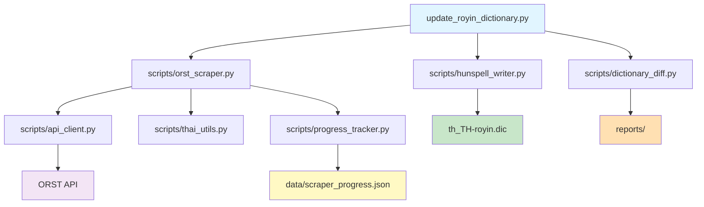

# Development Guide

Guide for developers contributing to or extending the ORST Dictionary Scraper.

## Table of Contents

- [Development Setup](#development-setup)
- [Project Structure](#project-structure)
- [Running Tests](#running-tests)
- [Code Quality](#code-quality)
- [Development Workflow](#development-workflow)
- [Module Reference](#module-reference)

## Development Setup

### Prerequisites

- **Python**: 3.10 or higher
- **pip**: Latest version recommended
- **Git**: For version control

### Environment Setup

```bash
# Clone the repository
git clone https://github.com/SyafiqHadzir/orst-scrapper.git
cd orst-scrapper

# Create virtual environment
python -m venv .venv

# Activate virtual environment
# Windows PowerShell:
.\.venv\Scripts\Activate.ps1

# Linux/macOS:
source .venv/bin/activate

# Install dependencies
pip install -r requirements.txt

# Install development dependencies
pip install pytest pytest-cov mypy ruff
```

### Verify Installation

```bash
# Run quick API test
python test_api_quick.py

# Run unit tests
pytest tests/ -v

# Expected output: All tests passing
```

## Project Structure

### Directory Layout

```
orst-scrapper/
├── .agent/                          # Automation workflows
│   └── workflows/
│       └── update-royin.md          # Dictionary update workflow
│
├── data/                            # Runtime data (gitignored)
│   ├── cache/                       # API response cache
│   │   └── *.json                   # Cached API responses
│   ├── scraper_progress.json        # Progress tracking state
│   └── scraper.log                  # Execution logs
│
├── docs/                            # Documentation
│   ├── ARCHITECTURE.md              # System design and components
│   ├── USAGE.md                     # User guide
│   └── DEVELOPMENT.md               # This file
│
├── reports/                         # Generated reports (gitignored)
│   ├── audit_report.md              # Change summary
│   ├── added_words.txt              # New words list
│   └── ghost_words.txt              # Removed words list
│
├── scripts/                         # Core scraper modules
│   ├── __init__.py                  # Package initialization
│   ├── config.py                    # Configuration constants
│   ├── api_client.py                # ORST API client
│   ├── thai_utils.py                # Thai language utilities
│   ├── progress_tracker.py          # Progress persistence
│   ├── orst_scraper.py              # Main scraper engine
│   ├── hunspell_writer.py           # Dictionary file writer
│   └── dictionary_diff.py           # Diff analyzer
│
├── tests/                           # Unit tests
│   └── test_thai_utils.py           # Thai utilities tests
│
├── .gitignore                       # Git ignore patterns
├── LICENSE                          # GPL-3.0 license
├── README.md                        # Project overview
├── CONTRIBUTING.md                  # Contribution guidelines
├── pyproject.toml                   # Tool configuration
├── requirements.txt                 # Python dependencies
├── test_api_quick.py                # Quick API connectivity test
└── update_royin_dictionary.py       # Main entry point
```

### Key Components

| Component | Purpose | Dependencies |
|-----------|---------|--------------|
| `update_royin_dictionary.py` | Entry point, CLI argument parsing | All modules |
| `scripts/config.py` | Configuration management | None (base) |
| `scripts/api_client.py` | HTTP client with retry/cache | `requests`, `config` |
| `scripts/thai_utils.py` | Thai text processing | `unicodedata2` |
| `scripts/progress_tracker.py` | State persistence | `json`, `pathlib` |
| `scripts/orst_scraper.py` | Main orchestrator | All above modules |
| `scripts/hunspell_writer.py` | Dictionary file generation | `thai_utils` |
| `scripts/dictionary_diff.py` | Change analysis | `thai_utils` |

### Data Flow



## Running Tests

### Unit Tests

```bash
# Run all tests
pytest tests/ -v

# Run specific test file
pytest tests/test_thai_utils.py -v

# Run specific test function
pytest tests/test_thai_utils.py::test_thai_sort_key -v

# Show print statements
pytest tests/ -v -s
```

### Test Coverage

```bash
# Generate coverage report
pytest tests/ --cov=scripts --cov-report=html

# Open coverage report (PowerShell)
Invoke-Item htmlcov/index.html

# Open coverage report (Linux/macOS)
open htmlcov/index.html
```

**Coverage Goals**:
- **Overall**: >90%
- **Critical modules** (`thai_utils`, `api_client`): >95%
- **New code**: 100%

### Integration Tests

```bash
# Test full scraping workflow (dry-run)
python update_royin_dictionary.py --dry-run --verbose

# Test API connectivity
python test_api_quick.py
```

### Writing Tests

**Test File Structure**:
```python
# tests/test_module_name.py
import pytest
from scripts.module_name import function_to_test

def test_function_basic():
    """Test basic functionality."""
    result = function_to_test("input")
    assert result == "expected"

def test_function_edge_case():
    """Test edge case handling."""
    with pytest.raises(ValueError):
        function_to_test(invalid_input)

@pytest.mark.parametrize("input,expected", [
    ("ก", True),
    ("a", False),
])
def test_function_parametrized(input, expected):
    """Test multiple inputs."""
    assert function_to_test(input) == expected
```

**Best Practices**:
- One test file per module
- Descriptive test function names
- Test both success and failure cases
- Use fixtures for common setup
- Mock external dependencies (API calls, file I/O)

## Code Quality

### Type Checking with mypy

```bash
# Type check all scripts
mypy scripts/

# Type check specific file
mypy scripts/thai_utils.py

# Strict mode
mypy scripts/ --strict
```

**mypy Configuration** (`pyproject.toml`):
```toml
[tool.mypy]
python_version = "3.10"
warn_return_any = true
warn_unused_configs = true
disallow_untyped_defs = true
```

### Linting with ruff

```bash
# Check all files
ruff check scripts/

# Auto-fix issues
ruff check scripts/ --fix

# Check specific file
ruff check scripts/thai_utils.py
```

**ruff Configuration** (`pyproject.toml`):
```toml
[tool.ruff]
line-length = 100
select = ["E", "F", "I", "N", "W"]
ignore = ["E501"]  # Line length (handled by formatter)
```

### Code Formatting

```bash
# Check formatting
ruff format scripts/ --check

# Auto-format
ruff format scripts/
```

**Style Guide**:
- **Line length**: 100 characters
- **Indentation**: 4 spaces
- **String quotes**: Double quotes preferred
- **Import order**: stdlib, third-party, local
- **Docstrings**: Google-style

### Pre-commit Checks

Run before committing:

```bash
# Complete check sequence
ruff check scripts/ --fix
ruff format scripts/
mypy scripts/
pytest tests/ --cov=scripts
```

## Development Workflow

### Feature Development

1. **Create feature branch**:
   ```bash
   git checkout -b feature/your-feature-name
   ```

2. **Implement feature**:
   - Write code following style guide
   - Add type hints
   - Add docstrings

3. **Write tests**:
   - Unit tests for new functions
   - Integration tests if applicable
   - Aim for >90% coverage

4. **Run quality checks**:
   ```bash
   ruff check scripts/ --fix
   ruff format scripts/
   mypy scripts/
   pytest tests/ -v --cov=scripts
   ```

5. **Commit changes**:
   ```bash
   git add .
   git commit -m "Add feature: description"
   ```

6. **Push and create PR**:
   ```bash
   git push origin feature/your-feature-name
   ```

### Bug Fixes

1. **Create bug fix branch**:
   ```bash
   git checkout -b fix/bug-description
   ```

2. **Write failing test**:
   ```python
   def test_bug_reproduction():
       """Reproduce the bug."""
       # Test that currently fails
   ```

3. **Fix the bug**:
   - Implement fix
   - Ensure test now passes

4. **Verify fix**:
   ```bash
   pytest tests/ -v
   ```

5. **Commit and push**

### Debugging

#### Enable Verbose Logging

```python
# In update_royin_dictionary.py or any script
import logging
logging.basicConfig(level=logging.DEBUG)
```

#### Interactive Debugging

```python
# Add breakpoint in code
import pdb; pdb.set_trace()

# Or use debugger-friendly print
print(f"Debug: variable={variable!r}")
```

#### Test Individual Components

```python
# Test API client
from scripts.api_client import ORSTAPIClient
from pathlib import Path

client = ORSTAPIClient(Path("data/cache"), delay_ms=200)
results = client.search_word("ก")
print(results)
```

## Module Reference

### config.py

**Purpose**: Centralized configuration  
**Key Exports**:
- `ORST_API_BASE_URL`: API endpoint
- `DEFAULT_DELAY_MS`: Rate limiting delay
- `NORMALIZE_UNICODE`: Processing flag

**Usage**:
```python
from scripts.config import DEFAULT_DELAY_MS, ORST_API_BASE_URL
```

---

### api_client.py

**Purpose**: HTTP client for ORST API  
**Key Class**: `ORSTAPIClient`

**Methods**:
```python
class ORSTAPIClient:
    def __init__(self, cache_dir: Path, delay_ms: int = 200)
    def search_word(self, query: str) -> List[Dict[str, Any]]
    def _make_request(self, params: Dict) -> requests.Response
    def _get_cached_response(self, cache_key: str) -> Optional[Dict]
```

**Example**:
```python
from scripts.api_client import ORSTAPIClient
from pathlib import Path

client = ORSTAPIClient(Path("data/cache"))
results = client.search_word("กระทรวง")
for result in results:
    print(result['headword'])
```

---

### thai_utils.py

**Purpose**: Thai language processing  
**Key Functions**:

```python
def normalize_thai_text(text: str) -> str
    """Apply NFC Unicode normalization."""

def is_valid_thai(text: str) -> bool
    """Validate Thai characters only."""

def thai_sort_key(word: str) -> tuple
    """Generate Royal Institute sort key."""

def get_thai_consonants() -> List[str]
    """Get list of Thai consonants ก-ฮ."""
```

**Example**:
```python
from scripts.thai_utils import normalize_thai_text, thai_sort_key

words = ["มา", "กา", "ยา"]
sorted_words = sorted(words, key=thai_sort_key)
print(sorted_words)  # ['กา', 'ยา', 'มา']
```

---

### progress_tracker.py

**Purpose**: Resumable progress tracking  
**Key Class**: `ProgressTracker`

```python
class ProgressTracker:
    def __init__(self, progress_file: Path)
    def save_progress(self, current_letter: str, words_collected: int)
    def load_progress(self) -> Optional[Dict]
    def clear_progress(self)
```

**Example**:
```python
from scripts.progress_tracker import ProgressTracker
from pathlib import Path

tracker = ProgressTracker(Path("data/scraper_progress.json"))
tracker.save_progress(current_letter="ก", words_collected=842)
progress = tracker.load_progress()
print(progress['current_letter'])  # 'ก'
```

---

### orst_scraper.py

**Purpose**: Main scraper orchestrator  
**Key Class**: `ORSTScraper`

```python
class ORSTScraper:
    def __init__(self, api_client: ORSTAPIClient, progress_tracker: ProgressTracker)
    def scrape_all_words(self) -> Set[str]
    def scrape_letters(self, letters: List[str]) -> Set[str]
```

---

### hunspell_writer.py

**Purpose**: Hunspell dictionary file writer  
**Key Class**: `HunspellDictionaryWriter`

```python
class HunspellDictionaryWriter:
    @staticmethod
    def write_dictionary(words: Set[str], output_path: Path, create_backup: bool = True)
    
    @staticmethod
    def validate_format(dic_path: Path) -> bool
```

---

### dictionary_diff.py

**Purpose**: Dictionary comparison and reporting  
**Key Class**: `DictionaryDiff`

```python
class DictionaryDiff:
    def __init__(self, old_words: Set[str], new_words: Set[str])
    def generate_report(self, output_dir: Path)
    def get_added_words(self) -> Set[str]
    def get_removed_words(self) -> Set[str]
```

## Common Development Tasks

### Adding New Configuration Option

1. **Add to `scripts/config.py`**:
   ```python
   # New configuration option
   NEW_FEATURE_ENABLED = True
   ```

2. **Update CLI argument parser** in `update_royin_dictionary.py`:
   ```python
   parser.add_argument('--enable-feature', action='store_true')
   ```

3. **Use in code**:
   ```python
   from scripts.config import NEW_FEATURE_ENABLED
   
   if NEW_FEATURE_ENABLED:
       # Feature logic
   ```

### Adding New Thai Utility Function

1. **Implement in `scripts/thai_utils.py`**:
   ```python
   def new_utility_function(text: str) -> str:
       """Brief description.
       
       Args:
           text: Input text
           
       Returns:
           Processed text
       """
       # Implementation
       return result
   ```

2. **Add tests in `tests/test_thai_utils.py`**:
   ```python
   def test_new_utility_function():
       assert new_utility_function("input") == "expected"
   ```

3. **Update module docstring** with usage example

### Extending API Client

1. **Add method to `scripts/api_client.py`**:
   ```python
   def get_word_definition(self, word: str) -> Dict:
       """Fetch word definition from API."""
       # Implementation
   ```

2. **Add error handling**
3. **Add tests with mocked API responses**
4. **Update ARCHITECTURE.md** if significant change

## Troubleshooting Development Issues

### Import Errors

```bash
# Ensure you're in correct directory
cd orst-scrapper  # Not scripts/

# Verify PYTHONPATH
echo $PYTHONPATH  # Should include project root

# Run with module syntax
python -m pytest tests/
```

### Test Failures

```bash
# Run with verbose output
pytest tests/ -vv

# Show full diff
pytest tests/ -vv --tb=long

# Stop on first failure
pytest tests/ -x
```

### Type Check Errors

```bash
# Show error context
mypy scripts/ --show-error-context

# Ignore specific error
# Add to code:
# type: ignore[error-code]
```

## Resources

- [Python Type Hints](https://docs.python.org/3/library/typing.html)
- [pytest Documentation](https://docs.pytest.org/)
- [mypy Documentation](https://mypy.readthedocs.io/)
- [ruff Documentation](https://docs.astral.sh/ruff/)
- [ORST API](https://dictionary.orst.go.th/)

## Next Steps

- Review [Architecture Documentation](ARCHITECTURE.md) for system design
- Review [Usage Guide](USAGE.md) for end-user documentation
- Check [CONTRIBUTING.md](../CONTRIBUTING.md) for contribution guidelines
